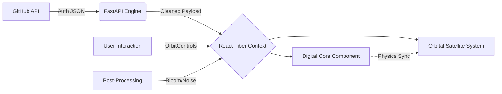

# 🌌 GitLens-3D

### A high-fidelity, real-time orbital visualization engine for GitHub ecosystems.


---

## 🛰️ Overview

**GitLens-3D** transforms static GitHub profiles into dynamic, interactive orbital systems. Built with a "Silicon-to-Software" philosophy, it bridges the gap between raw API data and high-fidelity generative art. The project serves as a real-time dashboard for developers to visualize their open-source impact through a celestial lens.

Most developer portfolios are flat and uninspired. GitLens-3D solves this by providing a **spatial narrative** of your work. Every repository is rendered as a satellite, its size and orbit dictated by real-world metrics like star count and disk size, orbiting a central "Digital Core" that represents the user's identity.

---

## 💎 Core Value Proposition

| Pillar | Description | Tech Implementation |
| :--- | :--- | :--- |
| **High Fidelity** | Crystalline aesthetics with neon-teal bloom and post-processing. | Three.js + R3F + PostProcessing |
| **Real-Time Sync** | Zero-latency state synchronization between GitHub and the 3D scene. | FastAPI + Axios + AbortController |
| **Deterministic Art** | Procedural generation ensures your "Galaxy" is unique but stable. | Stable Seed Hashing |
| **Silicon Minimal** | Dark-mode "Elite" UI designed for high-signal technical clarity. | Framer Motion + Inter/JetBrains Font |

---

## 🏗️ Architecture Overview



### Architectural Highlights
* **Decoupled State:** The 3D engine is wrapped in React Suspense to handle asynchronous font and data loading without UI blocking.
* **Polyglot Logic:** Python handles the heavy lifting of data sanitization and GitHub API rate-limiting, while JavaScript handles the mathematical orbital physics.
* **Memory Management:** Strictly managed WebGL contexts with `alpha: true` and `stencil: false` for optimized performance on integrated NPUs.

---

## 🛠️ Technical Deep Dive

### Security & State Model
* **AbortController Integration:** Prevents memory leaks and "race conditions" by canceling pending API requests on component unmount.
* **Optional Chaining Architecture:** A robust "Null Safety" model prevents WebGL context loss during state transitions.
* **Polyglot Persistence:** While currently stateless, the architecture supports Redis caching for high-traffic profile serving.

### Core Component Stack
| Component | Responsibility | Performance Strategy |
| :--- | :--- | :--- |
| `DigitalCore` | Central User Node | `useFrame` vertex distortion |
| `Satellite` | Repository Nodes | `useMemo` orbital math |
| `App.jsx` | System Orchestrator | Framer Motion AnimatePresence |
| `main.py` | Logic Layer | Async request handling |

---

## 🚀 Key Features

* **⚡ NPU Optimized:** Specifically tuned for smooth performance on modern silicon (e.g., Intel Lunar Lake/Zenbook series).
* **🌌 Celestial Mapping:** Stars and repositories are generated using deterministic seeds based on your unique GitHub metadata.
* **🧬 Adaptive UI:** A "Silicon-Minimalist" dashboard providing real-time system status and latency metrics.
* **✨ Post-Processed Bloom:** High-end visual effects that make your code glow in the dark.

---

## 📂 Project Structure

```text
gitlens-3d/
├── backend/
│   ├── main.py            # FastAPI Engine
│   └── .env               # GITHUB_TOKEN storage
├── frontend/
│   ├── src/
│   │   ├── components/
│   │   │   ├── DigitalCore.jsx
│   │   │   └── Satellite.jsx
│   │   ├── App.jsx        # Root Logic
│   │   └── index.css      # Elite UI styling
│   └── package.json
└── README.md
```

---

## 🏁 Quick Start

### 1. Clone the Galaxy
```bash
git clone https://github.com/KrishKamra/GitLens-3D.git
cd GitLens-3D
```

### 2. Ignition (Backend)
```bash
cd backend
python -m venv .venv
source .venv/bin/activate  # Or .venv\Scripts\activate on Windows
pip install -r requirements.txt
# Create .env and add GITHUB_TOKEN=your_token_here
uvicorn main:app --reload
```

### 3. Lift-off (Frontend)
```bash
cd ../frontend
npm install
npm run dev
```
Navigate to `http://localhost:5173` to see your orbital system.

---

## 🗺️ Roadmap

- [x] Phase 1: Core 3D Orbital Engine & FastAPI Integration
- [x] Phase 2: Post-processing Bloom & High-Fidelity UI
- [ ] Phase 3: Interactive Node Click (Expand repo details in 3D)
- [ ] Phase 4: Comparative Galaxies (Dual-view for two users)
- [ ] Phase 5: VR/AR Support via WebXR

---

## 🔮 Future Enhancements
* **CUDA Accelerated Textures:** Implementing custom shaders for more complex core distortion.
* **Blockchain Integration:** Minting unique "Galaxy Profiles" as dynamic NFTs.
* **Deep Social Integration:** Visualizing the "Connections" (followers) as constellations between different galaxies.

---

## 🤝 Contributing
Contributions are what make the open-source community an amazing place to learn, inspire, and create. Any contributions you make are **greatly appreciated**. Please see `CONTRIBUTING.md` for our "Silicon-Standard" code of conduct.

**Author:** [Krish Kamra](https://github.com/KrishKamra)  
**License:** Distributed under the MIT License. See `LICENSE` for more information.

---